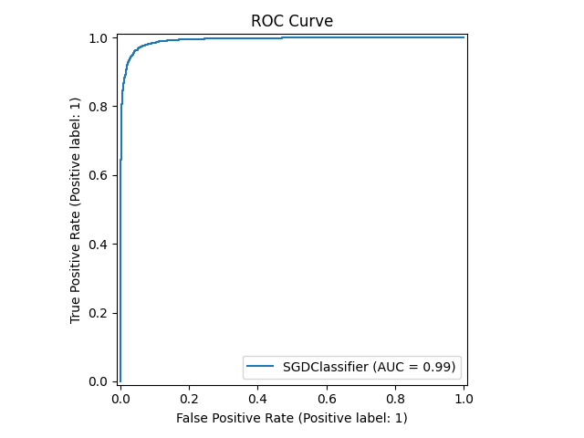
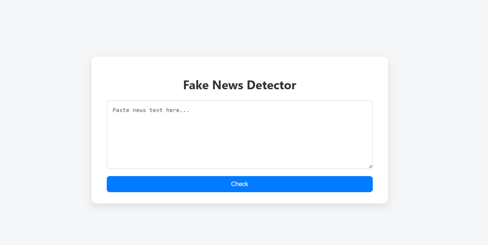

# 🧠 FakeNewsDetector  

[](https://www.python.org/)
[](https://www.tensorflow.org/)
[](https://scikit-learn.org/)
[](https://www.kaggle.com/clmentbisaillon/fake-and-real-news-dataset)
[](LICENSE)

---

**FakeNewsDetector** is an AI-powered project that detects **fake vs. real news** using machine learning and deep learning techniques.  
It evolves through three main versions (**V1 → V2 → V3**) that progressively improve data preprocessing, embeddings, and model accuracy.

---

## 📚 Dataset  

This project uses the **Fake and Real News Dataset** from **Kaggle**:  
> [Fake and Real News Dataset (Kaggle)](https://www.kaggle.com/clmentbisaillon/fake-and-real-news-dataset)

Download and place the following files in your project root:

```
fake.csv
true.csv
```

Each file contains:

| Column    | Description      |
| --------- | ---------------- |
| `title`   | Article title    |
| `text`    | Article content  |
| `subject` | News category    |
| `date`    | Publication date |

------

## 🧩 Versions Overview

| Version | Type             | Description                                                  |
| ------- | ---------------- | ------------------------------------------------------------ |
| **V1**  | Machine Learning | Baseline model using `SentenceTransformer` embeddings and `SGDClassifier`, includes log-loss visualization |
| **V2**  | ML (Optimized)   | Adds caching, hyperparameter tuning, cross-validation, and ROC/Confusion matrix exports |
| **V3**  | Deep Learning    | TensorFlow-based model reusing V2 embeddings; supports early stopping and accuracy plots |

------

## 📁 Project Structure

```
FakeNewsDetector/
│
├── V1_model.py                # Baseline ML model
├── V2_TrainingModel.py        # Refined ML pipeline
├── V3_TrainingModel.py        # Deep learning model (uses V2 embeddings)
│
├── DistributionAi.py          # Load + predict using saved model
├── Server.py                  # FastAPI endpoint for live predictions
│
├── templates/
│   └── index.html             # Web UI
│
├── fake.csv / true.csv        # Kaggle dataset
├── cache/                     # Cached embeddings
└── model_results_*/           # Auto-saved results, metrics, and plots
```

------

## ⚙️ Features

- Advanced text preprocessing (stopword removal, lemmatization, stemming)
- Sentence embeddings via `SentenceTransformer`
- SGDClassifier and TensorFlow neural models
- Automatic caching of embeddings
- Visualization of accuracy, loss, and confusion matrices
- Automatic export of metrics and trained models

------

## 🚀 Setup

### 1. Install dependencies

```
pip install pandas numpy nltk inflect tqdm scikit-learn matplotlib seaborn joblib sentence-transformers tensorflow fastapi uvicorn flask
```

### 2. Download dataset

Place `fake.csv` and `true.csv` from Kaggle into your project folder.

### 3. Run training

#### Train baseline (V1)

```
python V1_model.py
```

#### Train optimized ML model (V2) (use this or V3)

```
python V2_TrainingModel.py
```

#### Train deep learning model (V3)

```
python V3_TrainingModel.py
```

------

## 📊 Example Results

### Classification Report (V2 Example)

```
Accuracy : 95.73%
Precision: 0.957
Recall   : 0.957
F1-score : 0.957
```

| Class    | Precision | Recall | F1-score | Support |
| -------- | --------- | ------ | -------- | ------- |
| Real (1) | 0.95      | 0.97   | 0.96     | 4000    |
| Fake (0) | 0.97      | 0.95   | 0.96     | 4000    |

### Visual Outputs (auto-saved)

| Visualization          | Description                |
| ---------------------- | -------------------------- |
| `confusion_matrix.png` | True vs. predicted classes |
| `roc_curve.png`        | ROC-AUC analysis           |
| `loss_curve.png`       | Log-loss over iterations   |
| `metrics.csv`          | Full numeric report        |
| `best_model.joblib`    | Trained model              |

this is an example of  `roc_curve.png`**when training Model V2**



> **PS** :
>
> the output is saved automatically under:
>  `model_results_YYYYMMDD_HHMMSS/` for **V2** and `model_results_v3_YYYYMMDD/HHMMSS/` for **V3 ** 

------

## 🌐 Web API

Start a FastAPI server to interact with the trained model:

```
python Server.py
```

Then open your browser at:

```
http://127.0.0.1:8000/
```

You’ll find a minimal interface (`index.html`) where you can paste an article and get a prediction:
 **REAL** or **FAKE**, with confidence score.

> here is a screen shot of the final website
>
> 

------

## 💾 Model Reuse

You can use the saved model directly for predictions:

```
from joblib import load
model = load('model_results_*/best_model.joblib')
result = model.predict([text])
```

Or run:

```
python DistributionAi.py
```

------

## 🧭 Tips

- Enable GPU for faster embeddings (`torch.cuda.is_available()`)
- Easily switch embedding models in `V2_TrainingModel.py`
- Use `metrics.csv` for analytics or dashboard integration
- For production, use `Server.py` + `DistributionAi.py`

------

## 🧾 License

This project is licensed under the **MIT License** — see the [LICENSE](LICENSE) file for details.
 Dataset © Kaggle contributors (Fake and Real News Dataset).